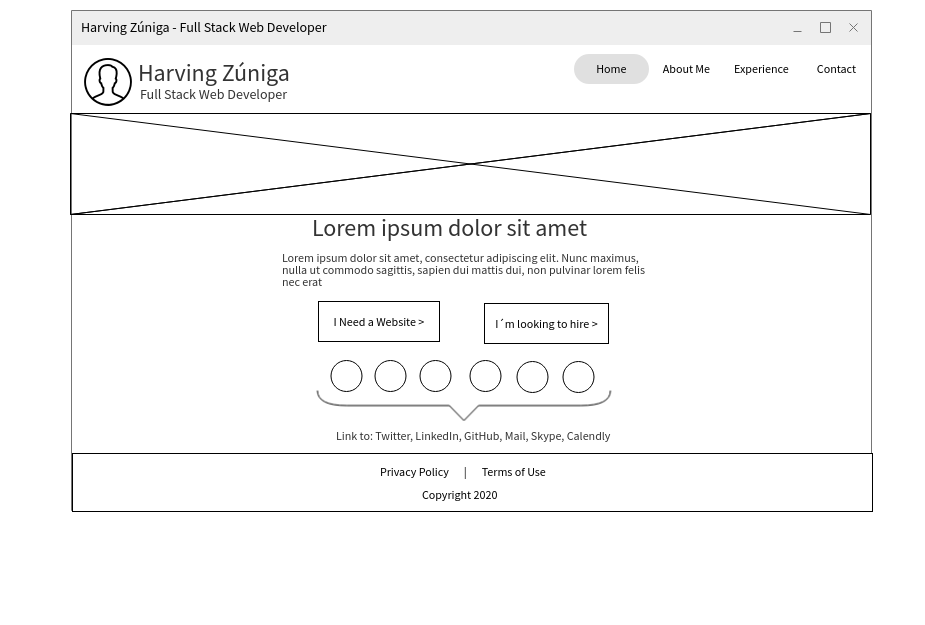
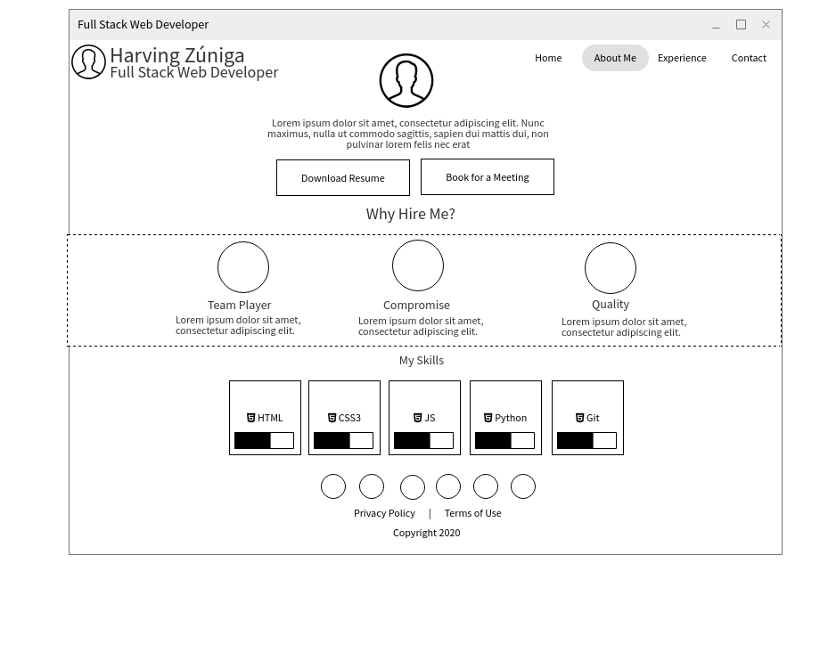
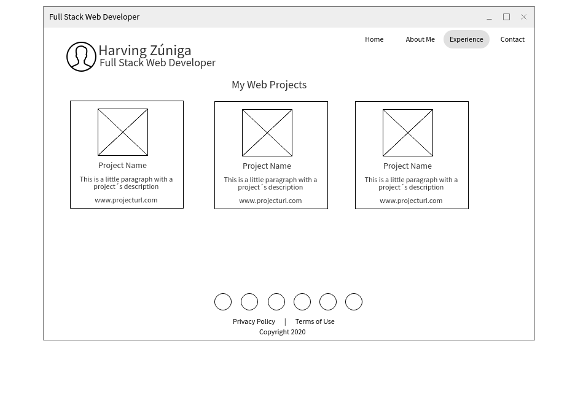
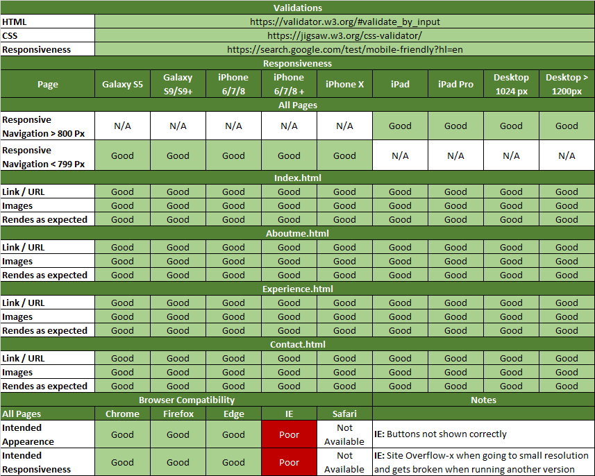

# Harvin Zúniga Personal Web

This is my personal website, it is developed as the Milestone One project within the Full Stack Web Developer program
with the Code Institute. In this project, I explain who I am, what I do, my work experience and the various ways that you can contact me. [This is the URL to the website](https://hfzespinoz4.github.io/MS1Project/)

## UX

The website is built for recruiters, they will be able to know my work experience and my technical skills as a Full Stack Developer. The site has a clean, intuitive and comfortable appearence to visit from any device, it is designed followin the Mobile First philosophy. 

### Design

The website is designed with basic information and a clean style that allow users to keep concentrated in what they´re are looking for. Also the user will find Call To Action buttons across all the website that can be identified by its red color.

### Structure

The website is estructured in the following pages:
  
  * Landing page: Is the first page that the user will see when visit my website, it will allow the user navigate in the website and the link to my social networks.
  
    * As user you will be able to contact me through all possibles options.
    * As user you will be able to navigate through all the website by using the button-based menu.
    * As recruiter you will be able to go directly to the "About Me" section that includes my technical skills
  
 * About Me: Contains information about me, education and habilities.
    * As user you will be able to navigate through all the website.
    * As user or recruiter you´ll be able to book for a meeting.
    * As recruiter you will be able to download a PDF version of my resume.
    * As user you will be able to contact me on my social networks by using the bottom social menu.
    
 * Experience: Contains information about my work experience and my projects on GitHub.
    * As user or recruiter you will be able to get information of all the project that I´ve done.
    * As user or recruiter you will be able to visit those project by clicking on the link under the short description.
    * As user or recruiter you will be able to navigate through all the website.
    * As user or recruiter you will be able to contact me on my social networks by using the bottom social menu.
 
 * Contact: Contains a contact form.
    * As user or recruiter you will be able to send me an email with your requerimients.
    * As user or recruiter you will be able to call me over telephone, skype or whatsapp.
    * As user or recruiter you will be able to book for a meeting annd send previous requerimients by clicking the book for a meeting button.
    * As user or recruiter you will be able to contact me on my social networks profiles.
    
### Wireframes

#### Home Page

#### About Me Page

#### Experience Page

## Features

#### Existing Features:

* Landing Page:
  * Button that allows users to contact me if they´re interested in a website.
  * button that allow recruiters to go directly to the about me section and know my technical skills.
  * Button based menu that allows user to navigate through all site.
  * Link to each one of my social networks profiles.

* About Me:
  * Navigation menu that allows users to navigate through all site.
  * Button that allows recruiters to download my CV in PDF format.
  * Button that allows recruiters to book for a meeting.
  * Progress Bar that allows recruiters to know my achievement on each web technologies.

* Experience:
  * Card-based information about all my projects.
  * Hover effects that allow users to know  wich project they´re are focused in.
  * Button based menu that allows user to navigate through all site.
  * Link to each one of my social networks profiles.

* Contact Page:
  * Button based menu that allows user to navigate through all site.
  * Contact form that allow users to send me an email.
  * Call menu that allows user to make a call over Telephone, Skype or WhatsApp
  * Button for book a meeting.

### Features Left

  * An slider in the main page that allows me to share information with users
  * Fully functional send button on Contact Page

## Technologies Used

My website use the following technologies:

  * [HTML5](https://en.wikipedia.org/wiki/HTML) 
    * As markup language for web design.
  * [CSS3](https://en.wikipedia.org/wiki/Cascading_Style_Sheets)
    * As style sheet laguage, used for describing the website style and presentation.
  * [Bootstrap 4](https://getbootstrap.com/)
    * For quicky design and customize as responsive mobile-first website.
  * [GIT](https://git-scm.com/)
    * As version control system.
  * [GitHub Pages](https://pages.github.com/)
    * For hosting and deploying the website .
  
 Also use the following tools:
 
 * [Visual Studio Code](https://code.visualstudio.com/)
    * As Integrated Development Environment (IDE).
 * [Calendly](https://calendly.com)
    * For Appointment and Schedule Meetings.
 * [Mockflow](https://www.mockflow.com/)
    * Is the tool that I´ve used to create the wireframe of the project.
 * [Google Search Tools](https://search.google.com/test/mobile-friendly?hl=es)
    * Used for validate the ownership of the project and Mobile Optimization
 
## Testing

To ensure a successfull user experience in the website I´ve done test in the following browsers:
  * Google Chrome.
  * Mozilla Firefox.
  * Microsoft Edge (Chromium Based Version).
  * Internet Explorer 11.
 
 *I was not able to run test on safari bacause I don´t have an Apple Device.
  
 Also made a simulation of the following devices in each browser using the Developer Tools:
  * Samsung Galaxy 5 (Android 5.0).
  * Samsung S9/S9+ (Android 7.0).
  * iPad.
  * iPhone 6/7/8 (iOS 11).
  * iPhone 6/7/8  Plus (iOS 11).
  * iPhone X/XS (iOS 12).
  * Kindle Fire HDX Linux.
  
  These are the results:
  
  
  
## Deployment

The project was deployed using Github Pages, the [URL](https://hfzespinoz4.github.io/MS1Project/) is automatic generated by GitHub and local deployment was not necesary in this case.

## Credits

### Media
The photos used in this project where obtained from:

  * [Hughes and Co](https://www.hughesandco.com/responsive-web-design-what-you-need-to-know/)
    * Is the author of the image used for the landing page.
  * [Website Depot](https://websitedepot.com/modern-yet-responsive-web-design-for-your-small-business/)
    * Is the author of theimage used as web project and other projects thumbnail.

### Animations 
The animations used in this project where obtained from:

* [Ian Luun](https://ianlunn.co.uk/articles/hover-css-tutorial-introduction/)
    * Is the author of the hover effects that I´ve used in this website
* [Fontawesome](https://fontawesome.com/)
    * Is the source were I found those awesome Vector icons for social logos, contact options and button´s icon. 
  
 
### Acknowledgment
This Project is inspired on:

  * Code Institute Wire Store Project
  * Code Institute Rosy Odenkrik Resume Project
  * Code Institute Love Running Project

I would like to acknowledge to the following persons:

  * God, my father. He give me the inspiration and the ability to do this.
  * Diego, my little son. He is my motivation and my strength.
  * Irlanda, my wife. She took care of everything so I could focus on the project.
  * Precious Ijege, my mentor. He guide me through this project.
